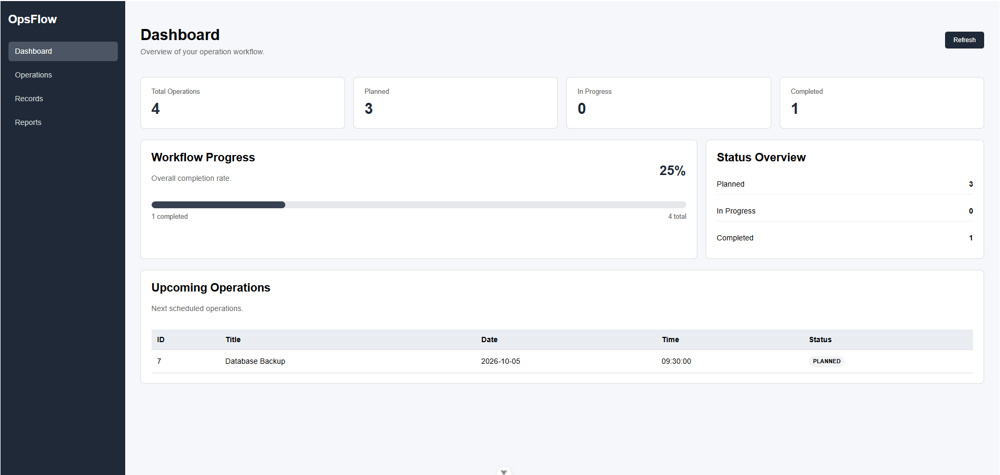
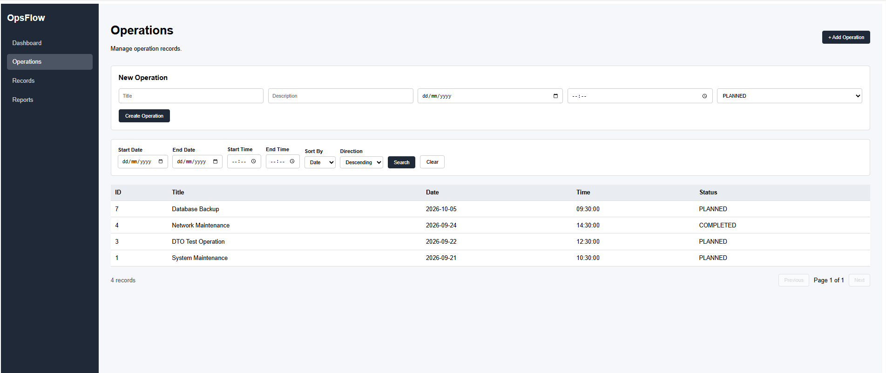
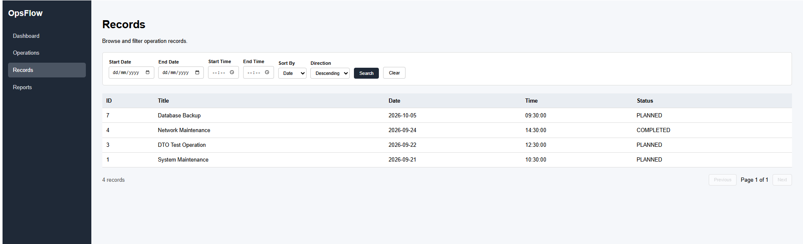
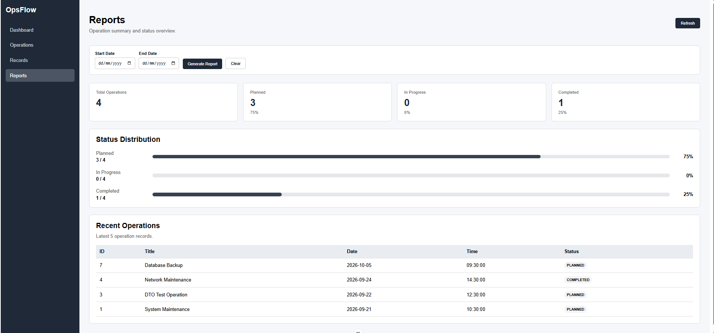

# OpsFlow

OpsFlow is a full-stack operations management application built with Spring Boot, Vue 3, and MySQL.

The application provides a web interface for creating, managing, searching, and monitoring operational records. It includes filtering, sorting, pagination, reporting, validation, dashboard statistics, and automated backend testing.

## Features

### Operation Management

- Create operation records
- Update existing operations
- Delete operations
- View operation details
- Track operation status
- Store operation date and time

### Search and Filtering

- Filter operations by date range
- Filter operations by time range
- Combine date and time filters
- Sort records by:
  - ID
  - Title
  - Date
  - Time
  - Status
- Ascending and descending sorting
- Server-side pagination

### Dashboard and Reporting

- Dashboard overview
- Total operation statistics
- Planned operation statistics
- In-progress operation statistics
- Completed operation statistics
- Workflow completion progress
- Upcoming operations
- Recent operations
- Status distribution
- Date-based report filtering

### Backend

- REST API
- DTO-based request and response handling
- Request validation
- Global API error handling
- Spring Data JPA persistence
- MySQL database integration
- Automated repository tests
- Automated service tests
- Automated controller tests

### Frontend

- Vue 3 single-page application
- Vue Router navigation
- Dashboard view
- Operations management view
- Records view
- Reports view
- Configurable API base URL
- Loading and error states

---

## Screenshots

### Dashboard

Overview of operation statistics, workflow progress, status distribution, and upcoming operations.



### Operations Management

Create, manage, filter, sort, and browse operation records.



### Records

Browse operation records using date and time filters, sorting, and pagination.



### Reports

View operation summaries, status distribution, completion statistics, and recent operations.



---

## Tech Stack

### Backend

- Java 17
- Spring Boot
- Spring Web
- Spring Data JPA
- Jakarta Validation
- MySQL
- Maven

### Frontend

- Vue 3
- Vue Router
- JavaScript
- Vite
- HTML5
- CSS3

### Testing

- JUnit 5
- Spring Boot Test
- MockMvc
- Repository integration testing
- Service testing
- Controller/API testing

### Development Tools

- IntelliJ IDEA
- MySQL Workbench
- Git
- GitHub

---

## Architecture

OpsFlow uses a layered backend architecture together with a separate Vue frontend.

```text
Vue 3 Frontend
      |
      | HTTP / JSON
      v
Spring REST Controller
      |
      v
Service Layer
      |
      v
Repository Layer
      |
      v
MySQL Database
```

The backend separates API, business logic, persistence, and data-transfer responsibilities.

### Backend Layers

**Controller**

Handles HTTP requests and exposes REST endpoints.

**DTO**

Defines request and response objects used by the API.

**Service**

Contains operation management and business logic.

**Repository**

Provides database access through Spring Data JPA.

**Entity**

Represents persisted operation records.

**Exception**

Provides centralized API exception handling.

---

## Project Structure

```text
opsflow-backend/
│
├── docs/
│   └── screenshots/
│       ├── dashboard.png
│       ├── operations.png
│       ├── records.png
│       └── reports.png
│
├── frontend/
│   ├── public/
│   ├── src/
│   │   ├── config/
│   │   │   └── api.js
│   │   ├── router/
│   │   │   └── index.js
│   │   ├── views/
│   │   │   ├── DashboardView.vue
│   │   │   ├── OperationsView.vue
│   │   │   ├── RecordsView.vue
│   │   │   └── ReportsView.vue
│   │   ├── App.vue
│   │   └── main.js
│   ├── .env.example
│   ├── package.json
│   └── vite.config.js
│
├── src/
│   ├── main/
│   │   ├── java/com/opsflow/backend/
│   │   │   ├── controller/
│   │   │   ├── dto/
│   │   │   ├── entity/
│   │   │   ├── exception/
│   │   │   ├── repository/
│   │   │   ├── service/
│   │   │   └── OpsflowBackendApplication.java
│   │   └── resources/
│   │       └── application.properties
│   │
│   └── test/
│       ├── java/com/opsflow/backend/
│       └── resources/
│
├── .gitignore
├── pom.xml
├── mvnw
├── mvnw.cmd
└── README.md
```

---

## API

The backend runs by default on:

```text
http://localhost:8080
```

The main operations API is available under:

```text
/api/operations
```

### Main Endpoints

| Method | Endpoint | Description |
|---|---|---|
| GET | `/api/operations` | Retrieve operations |
| POST | `/api/operations` | Create a new operation |
| GET | `/api/operations/{id}` | Retrieve an operation by ID |
| PUT | `/api/operations/{id}` | Update an operation |
| DELETE | `/api/operations/{id}` | Delete an operation |
| GET | `/api/operations/search` | Search, filter, sort, and paginate operations |

### Search Parameters

The search endpoint supports parameters including:

```text
startDate
endDate
startTime
endTime
page
size
sortBy
direction
```

Example:

```text
GET /api/operations/search?page=0&size=10&sortBy=operationDate&direction=desc
```

Date and time filters can also be combined.

Example:

```text
GET /api/operations/search?startDate=2026-09-01&endDate=2026-09-30&startTime=09:00&endTime=17:00&page=0&size=10
```

---

## Environment Configuration

### Backend

The application uses MySQL.

Example configuration:

```properties
spring.datasource.url=jdbc:mysql://localhost:3306/opsflow
spring.datasource.username=opsflow_user
spring.datasource.password=${DB_PASSWORD}
```

The database password is supplied through the `DB_PASSWORD` environment variable rather than being stored directly in the repository.

### Frontend

The frontend API URL is configurable using a Vite environment variable.

Create:

```text
frontend/.env
```

with:

```env
VITE_API_BASE_URL=http://localhost:8080
```

The local `.env` file should not be committed to Git.

An example configuration is provided in:

```text
frontend/.env.example
```

---

## Getting Started

### Prerequisites

Install the following:

- Java 17 or later
- MySQL
- Node.js
- npm
- Git

Maven commands can be executed using the included Maven Wrapper.

---

## Database Setup

Create a MySQL database:

```sql
CREATE DATABASE opsflow;
```

Create or configure a MySQL user with access to the database.

The default project configuration expects:

```text
Database: opsflow
Username: opsflow_user
```

Set the database password as an environment variable before starting the backend.

### Windows PowerShell

```powershell
$env:DB_PASSWORD="your_password"
```

Do not commit database passwords or other credentials to the repository.

---

## Running the Backend

From the project root:

### Windows

```powershell
.\mvnw.cmd spring-boot:run
```

Alternatively, run:

```text
OpsflowBackendApplication.java
```

from IntelliJ IDEA.

The backend should start on:

```text
http://localhost:8080
```

---

## Running the Frontend

Open another terminal and navigate to:

```bash
cd frontend
```

Install dependencies:

```bash
npm install
```

Create the local environment file:

```text
.env
```

and configure:

```env
VITE_API_BASE_URL=http://localhost:8080
```

Start the Vite development server:

```bash
npm run dev
```

The frontend is normally available at:

```text
http://localhost:5173
```

---

## Testing

The backend contains automated tests covering the repository, service, controller, and Spring application context.

Run all backend tests from the project root:

### Windows

```powershell
.\mvnw.cmd test
```

The test suite includes:

```text
OperationRecordRepositoryTest
OperationRecordServiceTest
OperationRecordControllerTest
OpsflowBackendApplicationTests
```

---

## Example Operation

An operation record contains information such as:

```json
{
  "title": "Database Backup",
  "description": "Scheduled database backup",
  "operationDate": "2026-10-05",
  "operationTime": "09:30",
  "status": "PLANNED